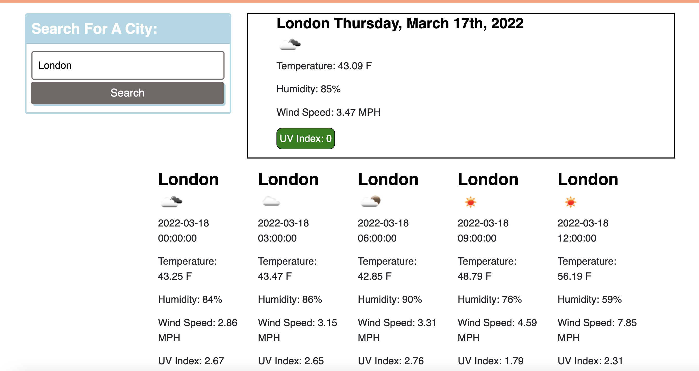

# weather-dashboard

 

This app uses a handful of Openweather App APIs to gather information for current weather and a 5 day forecast.  When you search a city name, you get the temperature, humidity, wind speed, UV Index, and an icon of the weather.  The current UV Index shows if it's favorable, moderate, or severe conditions. 

<a href="https://sacylkowski.github.io/weather-dashboard/">Here is the link to the webpage</a>

This code uses:
HTML
CSS
JS
Bootstrap
Moment
